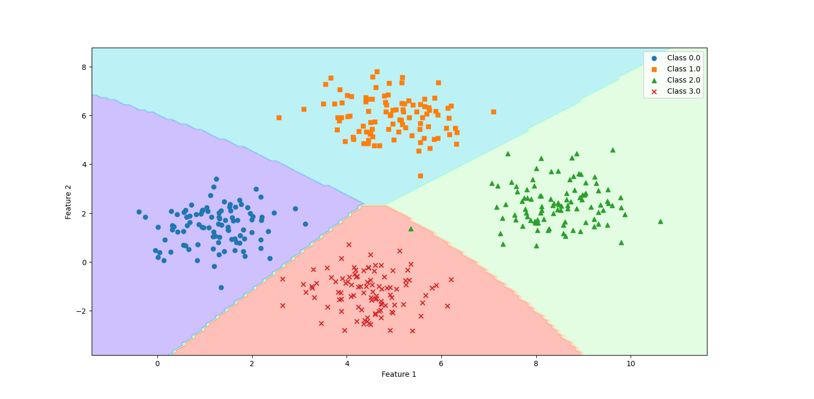
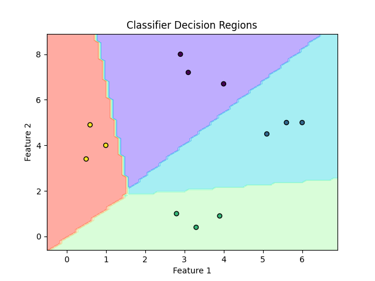

# 📊 Python Data Preprocessing & Classification Techniques

This repository demonstrates **data preprocessing techniques** and **basic classifiers** using `scikit-learn`. It includes examples with **visualizations** to help you understand how classifiers separate different classes.

---

## 🛠️ Techniques Covered

### Data Preprocessing

- **Mean Removal (Standardization):** Centering data so that the mean is 0 and standard deviation is 1.  
- **Scaling (Min-Max Scaling):** Rescales features to a fixed range (0 to 1).  
- **Normalization (L1/L2):** Scales rows to have unit norm.  
- **Binarization:** Converts numeric data into 0/1 using a threshold.  
- **Label Encoding:** Converts categorical labels into numeric form.

### Classification

- **Naïve Bayes Classifier:**  
  Uses Bayes theorem and assumes features are independent.  
  Example decision boundary:

  

- **Logistic Regression Classifier:**  
  Predicts class probabilities using a logistic function.  
  Example decision boundary:

  

---

## 🚀 Getting Started

### Prerequisites

- Python 3.x  
- NumPy  
- scikit-learn  
- Matplotlib (for visualizations)

### Installation

1. Clone the repository (optional):

```bash
git clone https://github.com/LeonMotaung/AI-Engineer.git
cd AI-Engineer
2. Install required packages:

```bash
pip install -r requirements.txt

- **Confusion Matrix:**
  Visualizes the performance of a classification model.

  